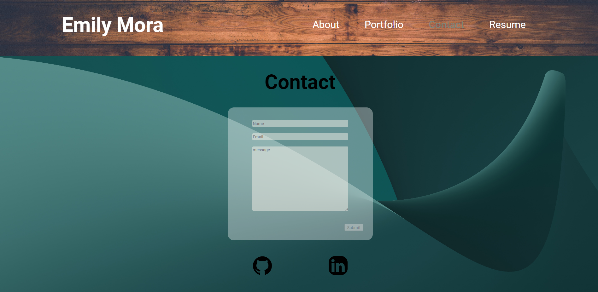
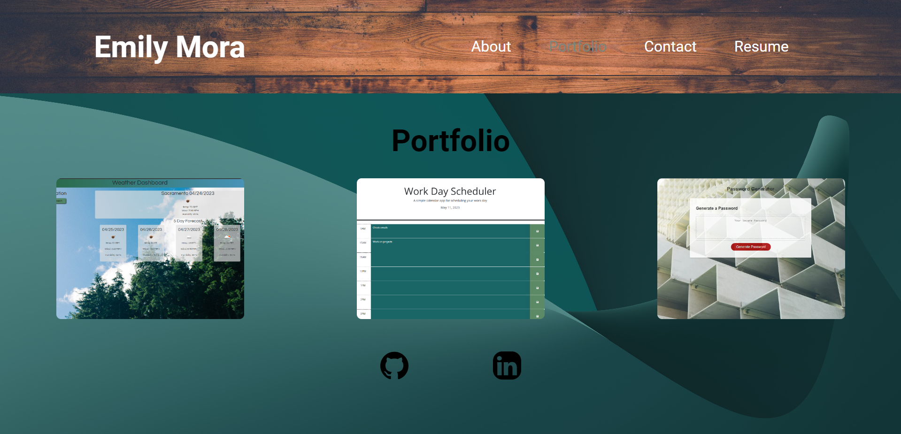

# React Portfolio

## Description

This application is used to showcase my portfolio and resume. I wanted to be able to show possible employers the skills I posess using my past projects as well as the skills in this application.

## Installation

In the project directory, you can run:

### `npm start`

Runs the app in the development mode.\
Open [http://localhost:3000](http://localhost:3000) to view it in your browser.

The page will reload when you make changes.\
You may also see any lint errors in the console.

## Usage

I this application you can view 4 different pages 

* About 
* Contact
* Portoflio
* Resume 
using the Navigation in the Header. 

Wehn you click on `Contact`. you can fill out a form with your name, email,l and a short message that will be sent to myself. 

When you click on `Portfolio`, you can view my past projects and click on the github repo as well as the deployed application. 

## Credits

This project was made as a React app. and I used Epxress for the sesrver. 

## License

MIT